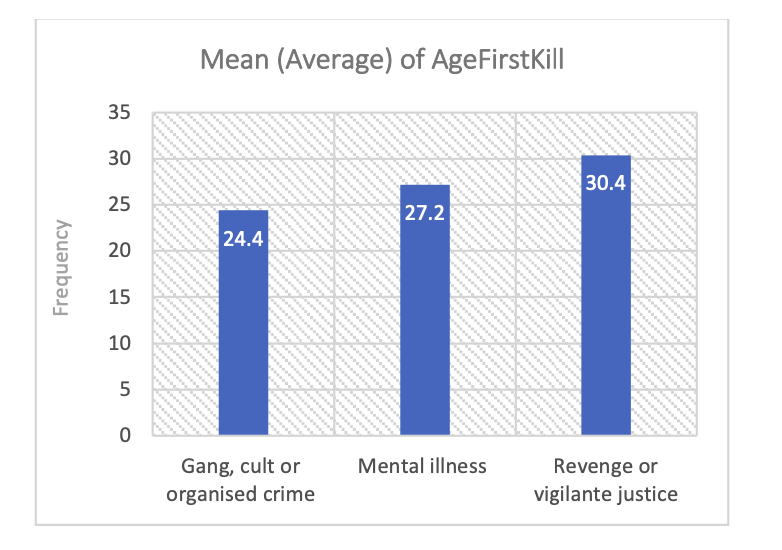
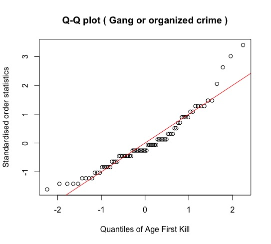
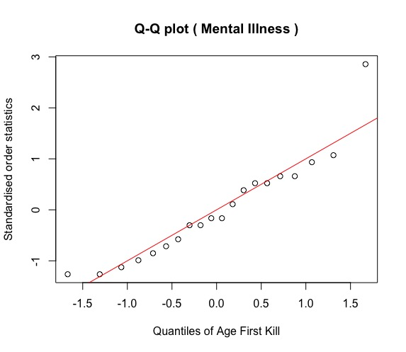
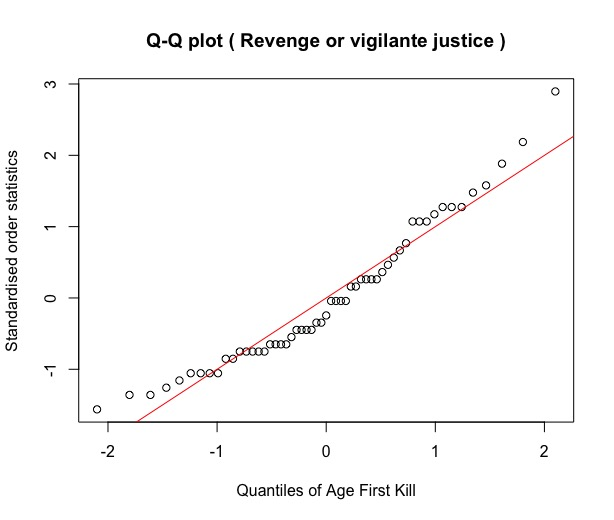
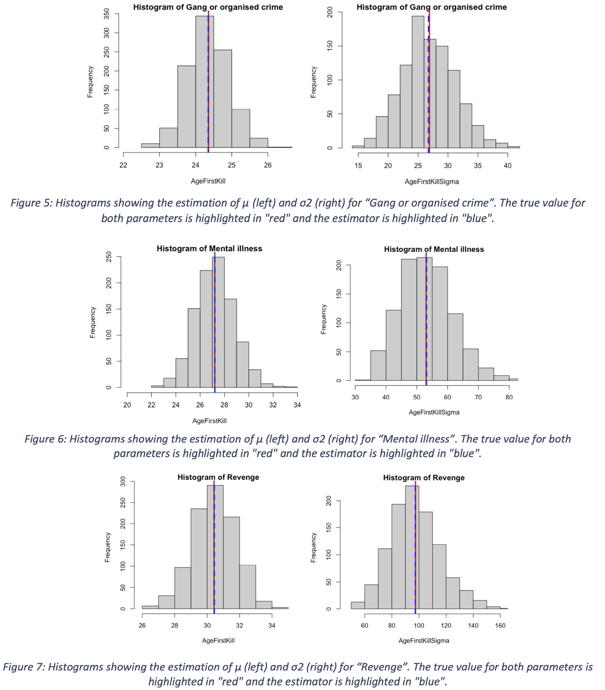
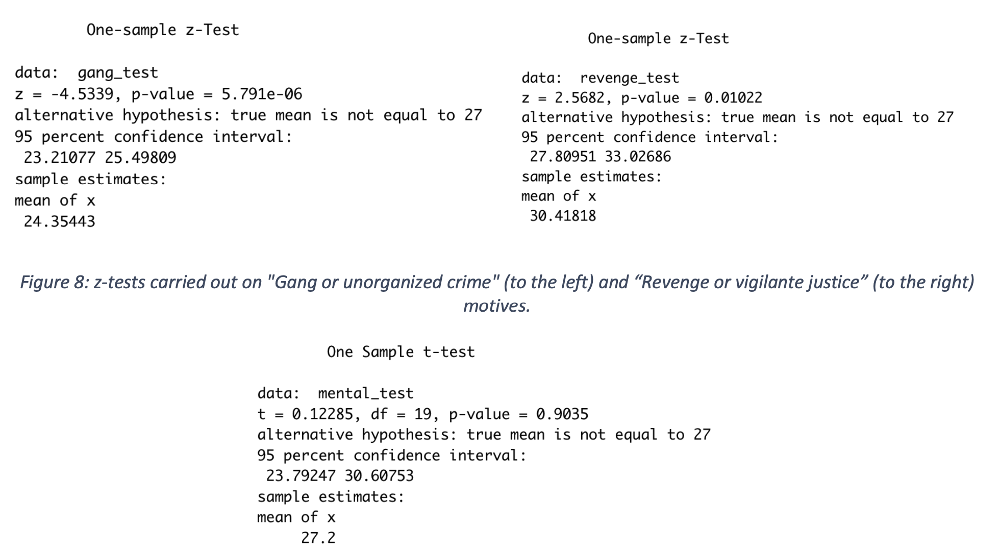
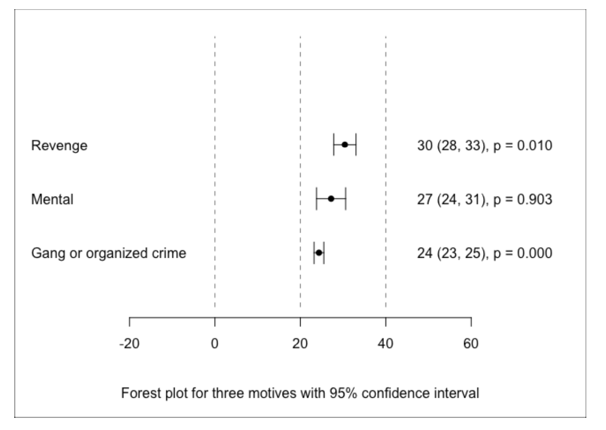

Interpreting the patterns of serial killers
===============================================
Prajwal Amin

 

Index
-----

- [Introduction](#introduction)
- [Data Exploration](#data-exploration)
- [Modelling](#modelling)
- [Estimation](#estimation)
- [Inference](#inference)
- [Conclusion](#conclusion)

 

Introduction
------------

There is no control over the surge of crimes reported all over the world, driven by various motives of the killer, moreover, there are serial killers who are striving to hunt their victims and end up being convicted of multiple murders. A serial killer typically is a person who commits the unlawful killing of two or more victims.

For this analysis, the data set obtained consists of the different behaviours or patterns that initiates a serial killer in committing a crime. There are several variables from the data set that can be helpful for the analysis, but the ones that are of interest would be “Motive” and “AgeFirstKill”, which state the reason behind committing a crime and the age of the killer when committing the first murder. There are three different motives included in the data set, through which the objective arises of finding out whether the average age at first murder differs between killers with different motives, and testing whether the proposed mean of 27 years is equal to that of the sample mean.

Data Exploration
----------------

The data set has a total of 9 variables with 191 observations, out of which 9 (5%) were found to be missing values and 27 (14%) observations with NA values. To make the analysis a bit clearer, two additional columns YearFirstKill (from AgeFirstKill and YearBorn) and CareerDuration (number of years between first and last kill) were created. Out of which, 1(0.5%) observation was removed where the YearFirstKill was less than 1900, resulting in a loss of almost 20% of observations from the data set.

After the pre-processing stage, there are a total of 154 observations, out of which 133 of the killers were found to be males and 21 females. Further, the tables and graphs below produce numerical and graphical summaries of the observations.

| Sex | Gand or Organized Crime (n = 79) | Mental illness (n=20) | Revenge or vigilante justice (n=55) |
| --------- | --------- | --------- | --------- |
| Male   | 76    | 8    | 49    |
| Female    | 3    | 12    | 6    |

| n=133 | AgeFirstKill | YearFirstKill | CareerDuration |
| --------- | --------- | --------- | --------- |
| Min    | 15    | 1908    | 0    |
| Max    | 59    | 2012    | 35    |
| Mean    | 26.89    | 1985    | 4.33    |
| SD    | 7.90    | 17.15    | 6.65    |

This gives an assumption that the average age at first kill differs between the motives, but can’t prove this assumption to be right just by visualizing the observations. We will have to propose models to find out which distribution the sample comes from and test for normality, for each of the motives.

Modelling
---------

The graphical (Q-Q plots) and numerical (Kolmogorov-Smirnov) tests executed on AgeFirstKill for each of the three motives indicate that the samples are forming a normal distribution.

After observing the above plots, we conclude that the samples from AgeFirstKill for each of the motives tend to follow a normal distribution. But still, we can run one more numerical test, i.e., the Kolmogorov-Smirnov test (KS test), to strengthen the conclusion. Here we get a p-value that the test generates and a significance level (5%) that we use to determine whether the sample follows a normal distribution. If the p-value > 5% (0.05), then it follows a normal distribution else, it does not follow a normal distribution. The p-value generated by the KS test is presented in the table below.

| Motive | D | P-value | 
| --------- | --------- | --------- |
| Gand or organized crime    | 0.15    | >0.07    |
| Mental illness    | 0.11    | >0.95   | 
| Revenge or vigilante justice    | 0.13    | >0.33    | 

Estimation
----------

In this stage, we will estimate the models using the parameters μ and σ2 for each of the motives.

Inference 
---------

We test whether the sample mean of age at first kill for each of the motives is equal to 27 by calculating confidence intervals. For this, z-test will be performed on “Gang or unorganized crime” and “Revenge or vigilante justice” motives since the sample sizes are greater than 30 (n = 79 & n = 55), then t-test will be carried out on “Mental illness” because of the sample size being less than 30 (n = 20).

In the above confidence interval tests proposed mean of 27 lies within the interval of “Mental illness”, hence our test cannot reject this value, but not in the case of the other two motives. Given Figure 10 is a forest plot with confidence intervals for different motives along with their point estimates of their mean.

Conclusion
----------

Based on the outcomes of the analysis, the samples tend to follow a normal distribution according to the graphical and numerical summaries, estimators have truly predicted the values for the parameter's mean and variance. We used the z-test and t-test to calculate the confidence intervals to determine the hypothesis.

Through the results of these tests, it can be observed that the average age at first kill does differ between the motives and the mean of 27 years may show some similarity, but not equal to the mean estimates of each of the motives. The report also conveys that a person motivated by Gang or unorganized crime does start at a younger age compared to the other two motives. However, we cannot blindly trust the outcomes of this analysis since the conclusions vary depending on the quality as well as the size of the sample. Moreover, considering the sample size of 154 in this case, it is obvious that the results won’t come out accurately. Meanwhile, I am eager to analyze the other two variables “Sentence” and “InsanityPlea” from this data set in the future.
